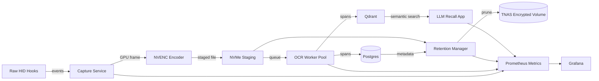

# System Architecture



## Data Flow Stages

1. **Event Detection** – Low-level HID hooks detect keyboard/mouse activity and notify the capture scheduler.
2. **GPU Capture** – DirectX desktop duplication grabs frames directly into GPU memory, including window metadata.
3. **Encoding & Staging** – Frames are encoded to WebP via NVENC and written to a fast NVMe staging folder.
4. **Deduplication** – Perceptual hashing prevents redundant uploads when frames are visually identical.
5. **Encryption & Transfer** – Encrypted chunks are streamed to the TNAS share, ensuring at-rest protection.
6. **OCR Pipeline** – GPU-accelerated OCR batches process staged images, emitting spans with confidence and bounding boxes.
7. **Metadata Persistence** – Capture metadata and OCR spans are written to Postgres; embeddings land in Qdrant.
8. **Retention** – A scheduled job enforces quota and age-based pruning, deleting oldest screenshots first while leaving metadata.
9. **Observability** – All services emit Prometheus metrics scraped by Grafana dashboards for real-time health insights.

## Performance Considerations

- **Direct GPU Path** – Avoids CPU copying and reduces latency for 8K frames.
- **Batching** – OCR and embeddings operate in configurable batches, maximizing GPU utilization while respecting latency.
- **Backpressure Controls** – Queue lengths, capture max pending, and staging directory quotas prevent resource exhaustion.
- **Duplicate Filtering** – Hashing combined with foreground window metadata removes up to 60% of redundant frames.
- **Half-Precision Embeddings** – Float16 storage halves NAS bandwidth while Qdrant still receives float32 vectors.

## Accuracy Safeguards

- **Full-resolution Processing** – No downsampling before OCR; ensures crisp text recognition.
- **Per-window Metadata** – Capture process names/titles to give LLM context beyond plain text.
- **Confidence Tracking** – OCR spans store confidence for filtering low-quality results during search.
- **LLM-Ready Payloads** – Embedding payloads include text, bounding boxes, and timestamps for rich prompt assembly.
```
