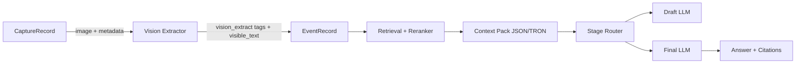

# VLM-First Fullscreen, Memory, and Phase 2 Hardening

## 1. Summary
Phase 2 hardening focuses on a VLM-first fullscreen extraction pipeline, deterministic time-series retrieval, and a repo-native critical memory subsystem, all optimized for a Windows 11 + WSL2 workstation with a single 7680×2160 display. The goal is to maximize performance and accuracy while preserving citations and local-first defaults.

## 2. Goals
- Preserve full-screen context with deterministic tiling and VLM-first extraction.
- Enforce citations with event_id + timestamps + evidence payload for every answer.
- Keep defaults local-first while allowing explicit per-stage cloud opt-in.
- Provide deterministic time-range parsing and timeline answers.
- Maintain a CI-enforced, append-only repo memory subsystem.

## 3. Non-Goals
- Multi-monitor capture orchestration beyond the existing virtual desktop layout.
- Remote/cloud-first operation or auto-upload of images by default.
- Changes to DB schema beyond additive metadata in existing tags/payloads.

## 4. User Stories / Requirements
- “I want my entire 7680×2160 screen preserved so later Q&A has full context.”
- “I need answers that always cite event_id and timestamps with evidence snippets.”
- “I want time-only queries to return a short, deterministic timeline.”
- “I need local-only defaults with explicit opt-in for any cloud stage.”

## 5. Current State (after audit)
- VLM-first extractor exists with tiling + RapidOCR fallback; vision_extract tags are stored.
- TRON encode/decode exists for context packs and structured outputs.
- Deterministic time parser exists; retrieval supports paging and time-range filtering.
- Stage-based LLM routing exists with per-stage cloud gating.
- Repo memory subsystem (.memory) exists with CI guard.

## 6. Proposed Architecture (Mermaid diagram)

## 7. Data Model (DB/tags + Qdrant payloads + paging)
- `events` table retains `screenshot_path`, `ts_start`, `ts_end`, and `tags.vision_extract`.
- `vision_extract` tag schema stores region bboxes, visible_text, parse metadata, and tile map.
- Context pack evidence includes `event_id`, `ts_start`, `ts_end`, and screenshot metadata.
- Retrieval supports `page`/`page_size` with SQL offsets; time-range filters limit results.

## 8. VLM-First Extraction (tiling, prompts, parsing)
- Default extractor: VLM (Qwen family). Fallback: RapidOCR.
- Tiling defaults: 3×2 grid + downscaled full-frame, row-major order.
- Prompt annotates each tile with normalized bbox and deterministic identifiers.
- Parsing order: JSON → TRON → plain-text fallback with parse_failed flags.

## 9. TRON (why/where; encode/decode; safety)
- TRON reduces token overhead for structured payloads.
- `output.format` controls answer serialization; `output.context_pack_format` controls payloads.
- Cloud TRON compression requires explicit `output.allow_tron_compression=true`.

## 10. Time-Series Queries (parser; retrieval; prompting; citations)
- Deterministic parser handles “last hour”, “an hour ago”, “yesterday 5 pm”, “yesterday at 17:00”.
- Time-only queries route to time-range retrieval and return a short timeline with citations.
- Citations always include event_id and timestamps in the evidence payload.

## 11. Model Routing by Stage (local defaults; cloud opt-in; guards)
- Stages: query_refine, draft_generate, final_answer, tool_transform.
- Default provider: local (Ollama/OpenAI-compatible localhost).
- Cloud usage requires per-stage `allow_cloud` plus privacy.cloud_enabled and offline=false.

## 12. Privacy & Security (local-only; secrets/PII; keys portability)
- Defaults are local-only; cloud image usage requires explicit opt-in.
- Repo memory guard rejects secrets/PII and enforces size limits.
- Keys export/import uses scrypt + AES-GCM; Windows imports rewrap with DPAPI.

## 13. Performance & Capacity (4090 tuning; async; caching; backpressure)
- GPU-first extraction and embeddings when available; deterministic tiling for 7680×2160.
- Async pipelines with OCR/embedding worker backpressure.
- Caching: research scout cache, prompt transforms (optional), and retrieval indexes.

## 14. Observability & Reliability (metrics; doctor; crash handling)
- Prometheus metrics for OCR latency, backlog, and retrieval latency.
- `autocapture doctor` validates paths, dependencies, and availability.
- Worker lease + heartbeat to recover from stuck tasks.

## 15. Test Plan
- Vision tiling determinism, TRON encode/decode, and parse fallback tests.
- Doctor Windows path fallback and error messaging.
- Evidence payload and citation coverage (standard + time-only queries).
- Research scout offline caching and diff threshold logic.

## 16. Migration / Rollout Plan
- Apply changes in one PR with CI gates (ruff/black/pytest/memory guard/release gate).
- Validate doctor path fix on Windows + WSL.
- Roll out scheduled research scout workflow after merge.

## 17. Decisions Log (reference ADRs in .memory)
- ADR-0001: Adopt event-sourced repo memory (.memory/LEDGER.ndjson).
